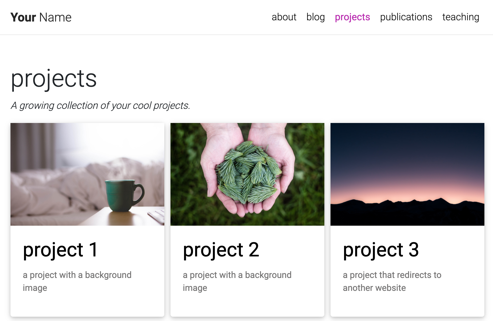

# Julian personal site

A personal site, built with Jekyll from the [al-folio template](https://github.com/alshedivat/al-folio).

### Notes

Use `bundle exec jekyll serve` to preview changes.

Use `bundle exec jekyll build` to just build. Files are located in _site. 
 
### Upgrading from a previous version

If you installed **al-folio** as described above, you can upgrade to the latest version as follows:

```bash
# Assuming the current directory is <your-repo-name>
$ git remote add upstream https://github.com/alshedivat/al-folio.git
$ git fetch upstream
$ git rebase upstream/v0.3.1
```

If you have extensively customized a previous version, it might be trickier to upgrade.
You can still follow the steps above, but `git rebase` may result in merge conflicts that must be resolved.
See [git rebase manual](https://help.github.com/en/github/using-git/about-git-rebase) and how to [resolve conflicts](https://help.github.com/en/github/using-git/resolving-merge-conflicts-after-a-git-rebase) for more information.
If rebasing is too complicated, we recommend to re-install the new version of the theme from scratch and port over your content and changes from the previous version manually.

### Collections

This Jekyll theme implements `collections` to let you break up your work into categories.
The theme comes with two default collections: `news` and `projects`.
Items from the `news` collection are automatically displayed on the home page.
Items from the `projects` collection are displayed on a responsive grid on projects page.

<p align="center"></p>

You can easily create your own collections, apps, short stories, courses, or whatever your creative work is.
To do this, edit the collections in the `_config.yml` file, create a corresponding folder, and create a landing page for your collection, similar to `_pages/projects.md`.
